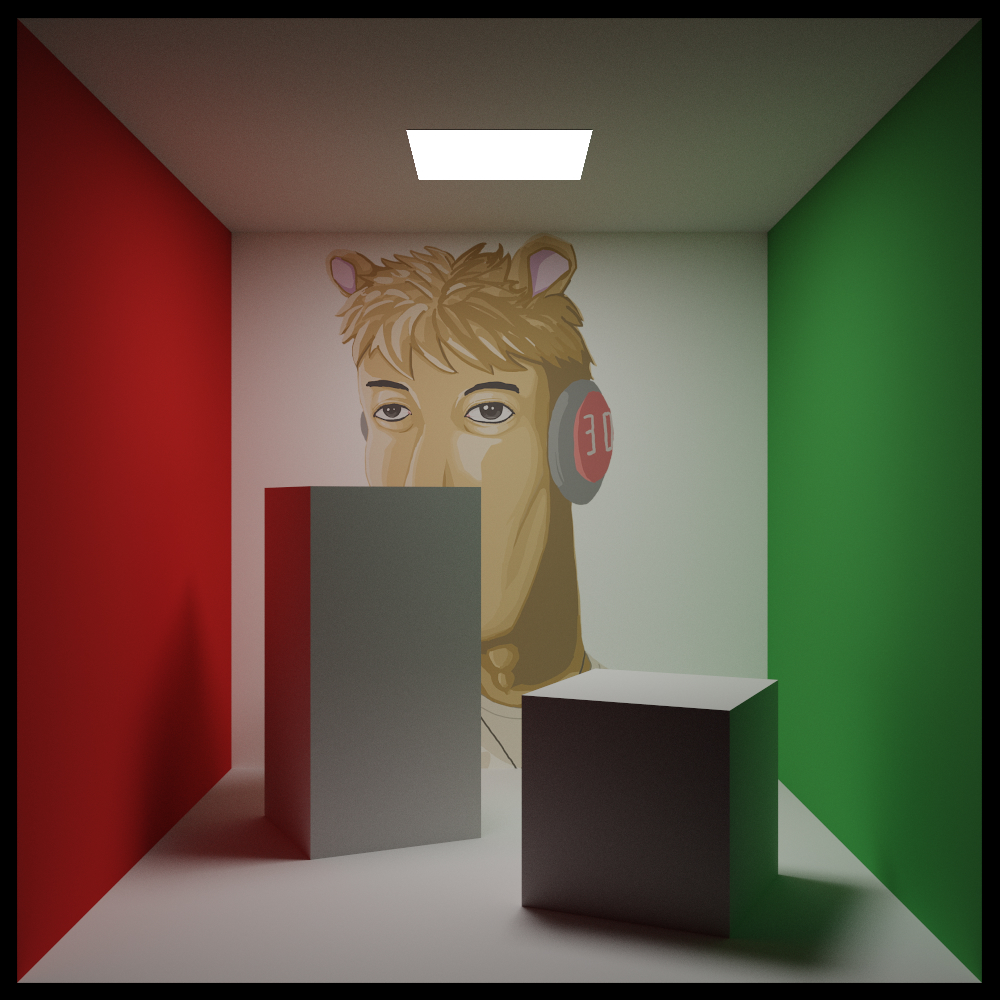
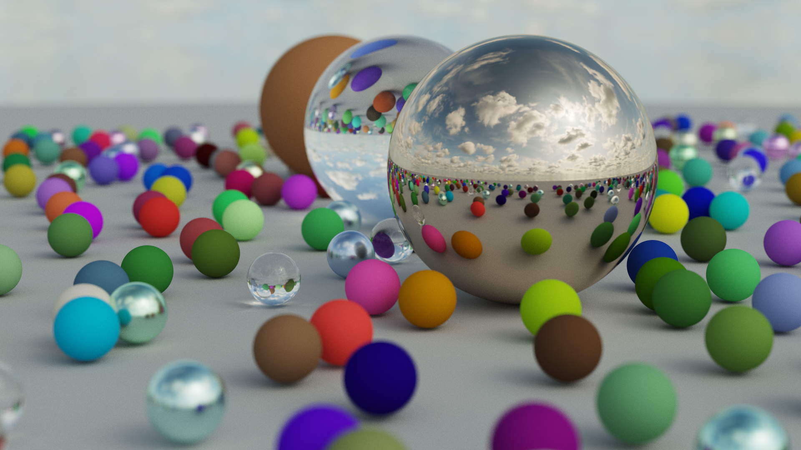
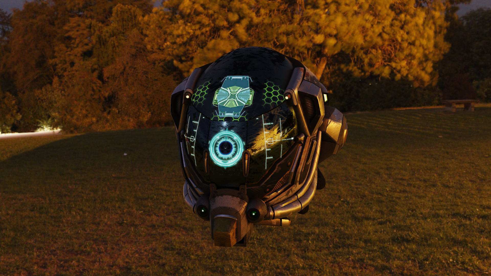
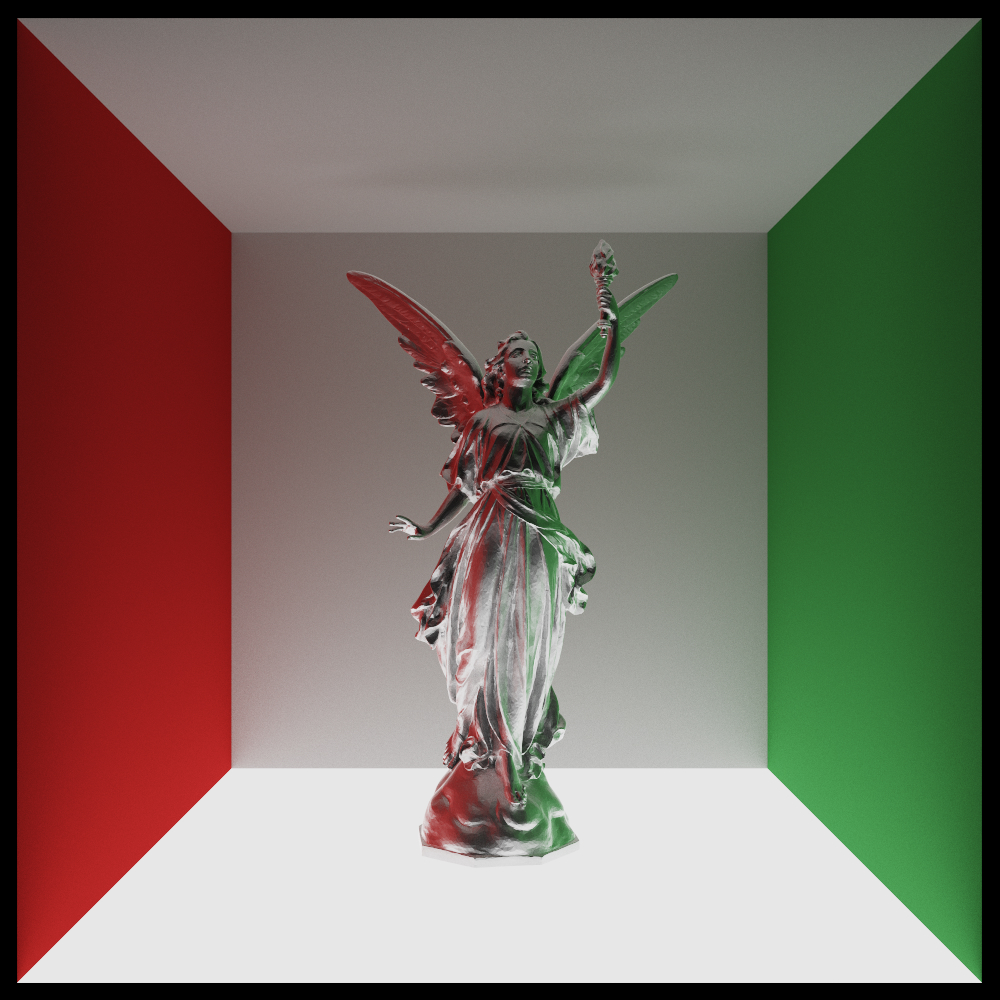
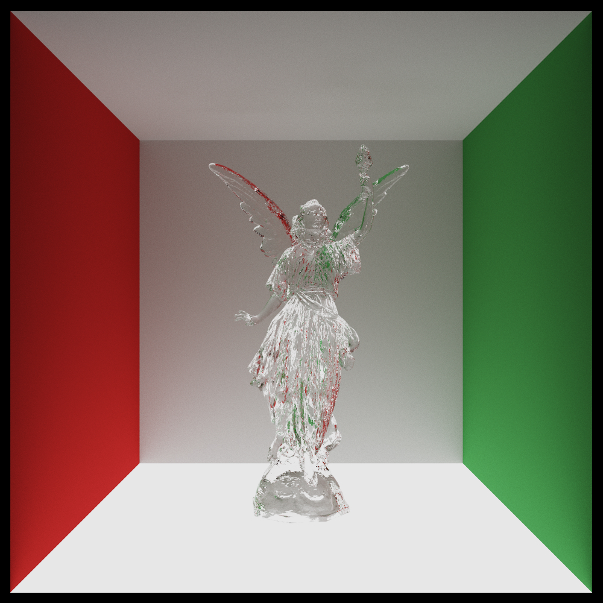
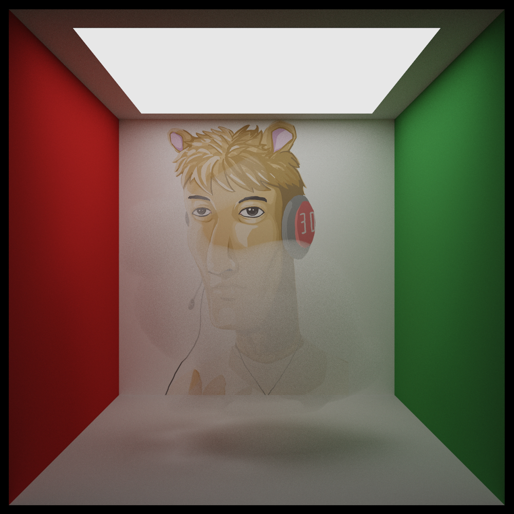
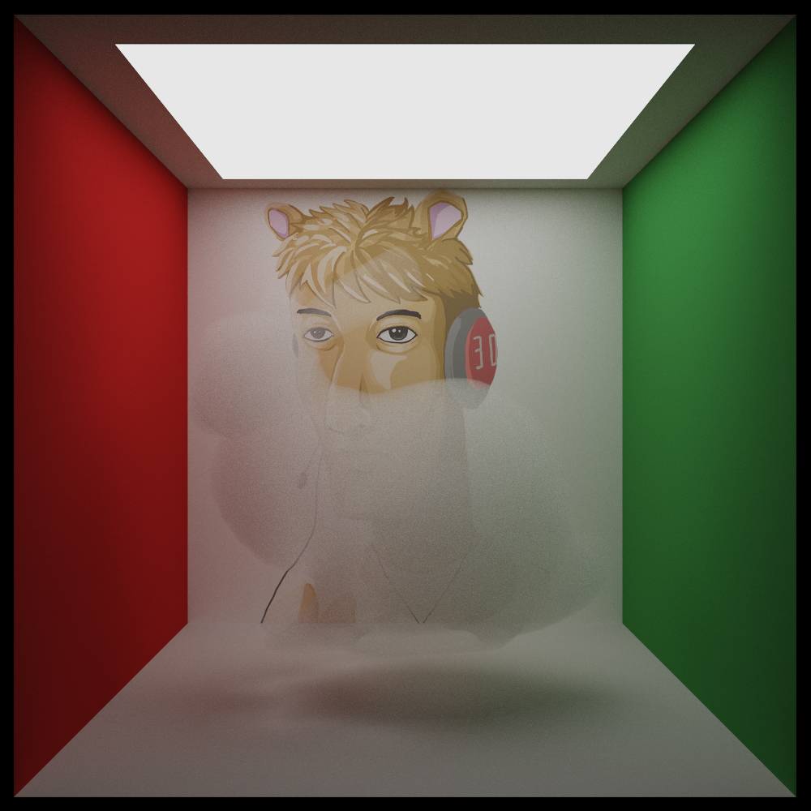
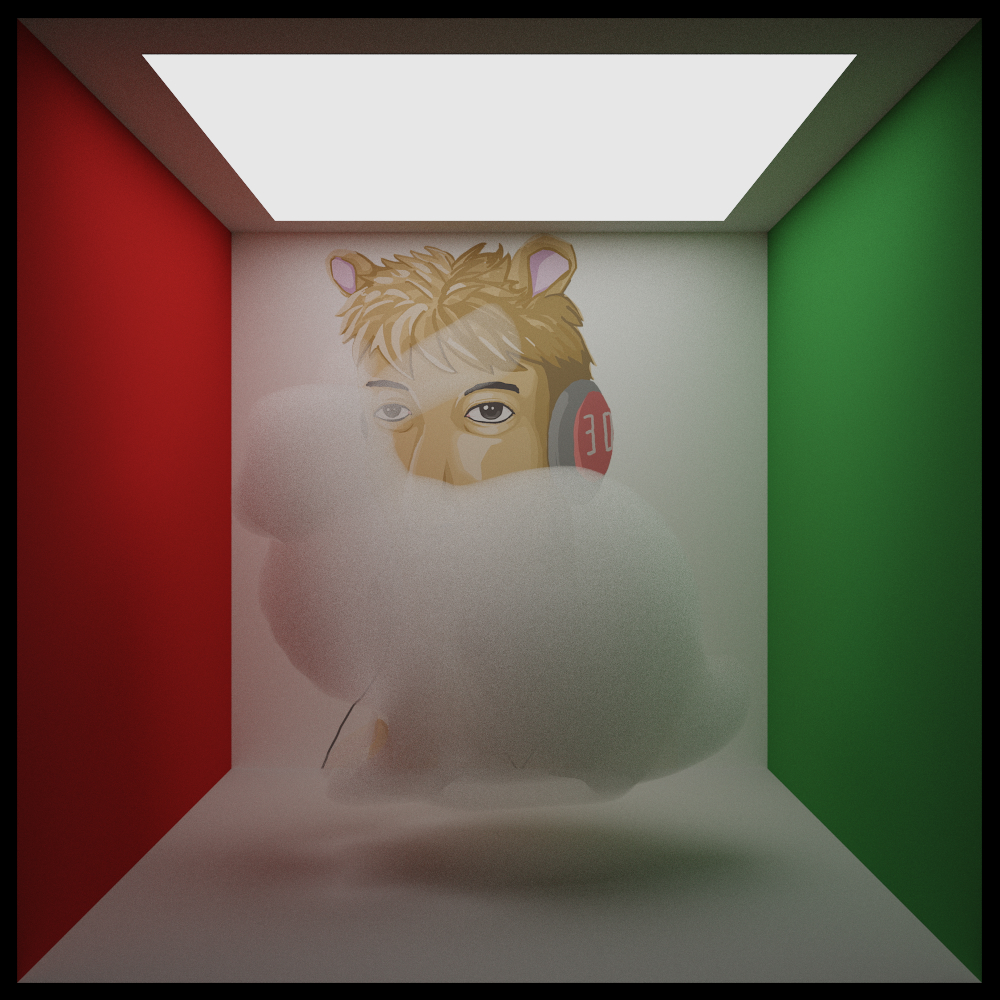

# Path Tracer

This is a CPU-only path tracer written in C++

## Features
- Unidirectional path tracing
- BVH accelerated ray tracing
- Multiple importance sampling
- Physically based materials
- Light sources
  - Directional light
  - Environment light
  - Area lights
- Volume rendering
- Modeling loading with Assimp
- Parallel processing with OpenMP

## Building
- Install [CMake](https://cmake.org/install/)
- Ensure CMake is in the system `PATH`
- Clone the repository `git clone --recursive https://github.com/Sopiro/PathTracer`
- Run CMake build script depend on your system
  - Visual Studio: Run `build.bat`
  - Otherwise: Run `build.sh`
  
## Todo
- Memory management
- Better material (BSDF and BSSRDF)
- Path tracing on GPU

## References
- https://raytracing.github.io
- https://learnopengl.com
- https://boksajak.github.io/blog/BRDF
- https://www.pbr-book.org
- https://agraphicsguynotes.com/posts/sample_microfacet_brdf/
- https://schuttejoe.github.io/post/ggximportancesamplingpart2/
- https://simonstechblog.blogspot.com/2020/01/note-on-sampling-ggx-distribution-of.html
- https://hal.inria.fr/hal-01024289/file/Heitz2014Slides.pdf
- https://jcgt.org/published/0007/04/01/

## Samples

|||
|--|--|

|||
|--|--|  

|||
|--|--|
|||