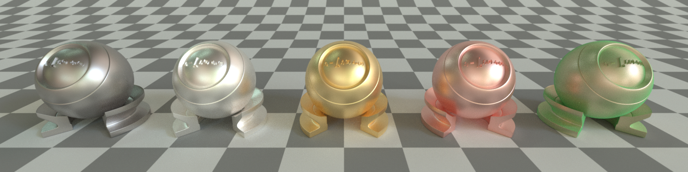
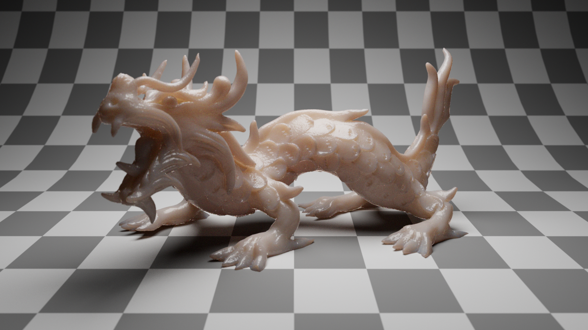
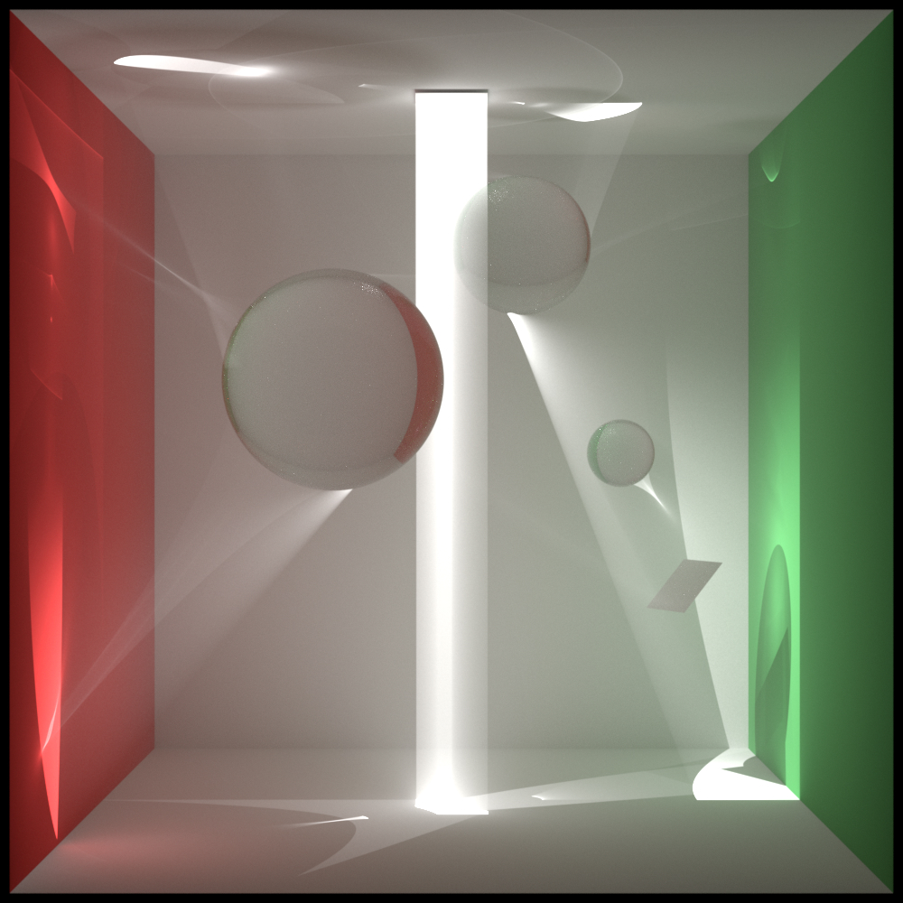
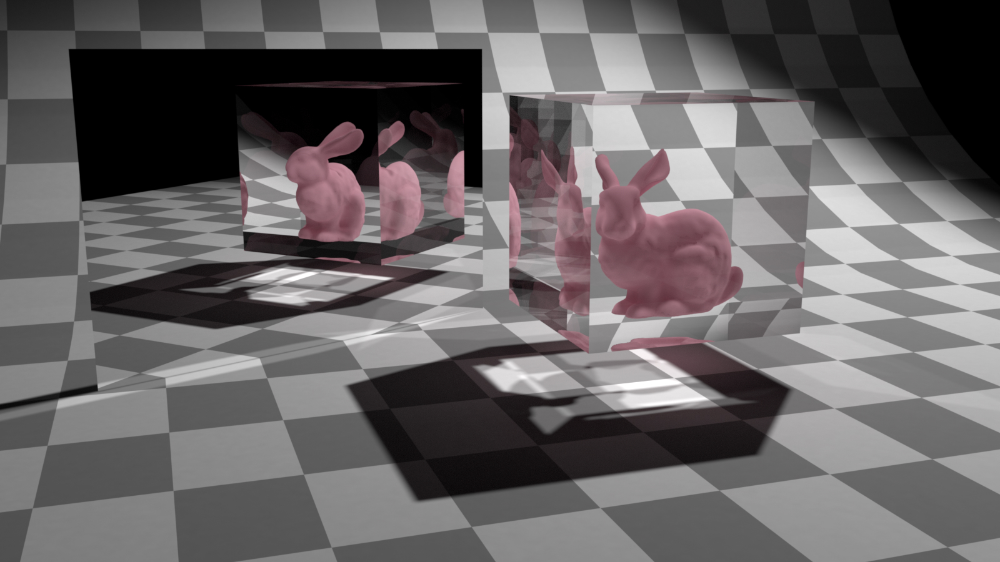
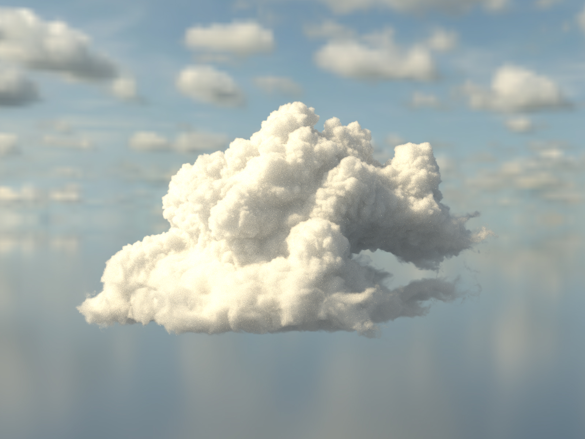
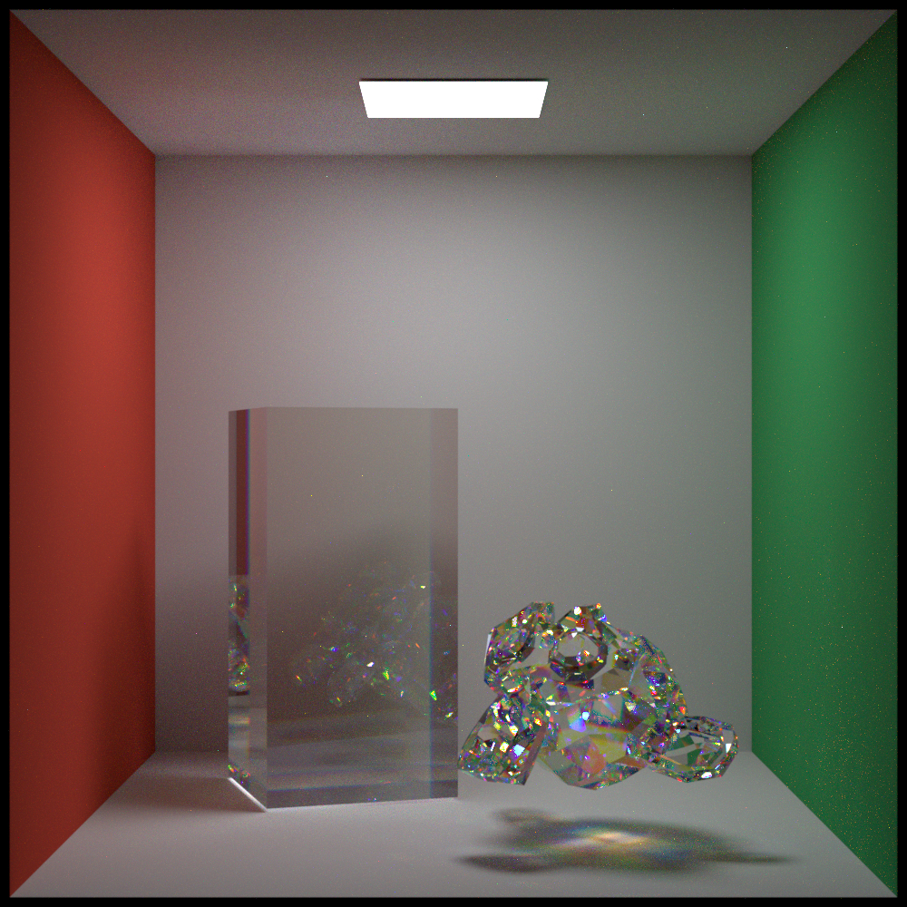
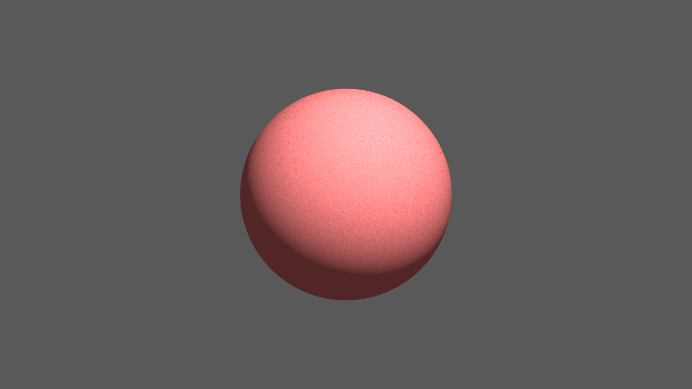

# Bulbit

[](https://github.com/Sopiro/Bulbit/actions/workflows/cmake-multi-platform.yml)

Bulbit is a physically based raytracing renderer.

## Features

Here are the rendering algorithms implemented in Bulbit.

### Integrator
- Unidirectional integrators
  - Path tracing with NEE and continuation ray MIS
  - Volumetric path tracing
  - Light tracing and Volumetric light tracing
  - Naive versions of above algorithms

- Bidirectional integrators
  - Bidirectional path tracing with MIS
  - Volumetric BDPT
  - Vertex Connection and Merging

- Photon mapping integrators
  - Original photon mapping and Volumetric photon mapping
  - Stochastic Progressive Photon Mapping
  - Volumetric SPPM

- ReSTIR integrators
  - Unbiased ReSTIR with hybrid shift (delayed reconnection)
  - GRIS with pairwise MIS
  - ReSTIR Direct lighting
  - ReSTIR Path tracing

- Others
  - Random walk ray tracing
  - Whitted style ray tracing
  - Ambient occlusion

### Light
- Light sources
  - Point, Spot and Directional light
  - Diffuse, Spot and Directional area light
- Light samplers
  - Uniform light sampler, Power light sampler

### Material
- BSDF
  - Lambertian and Specular reflection BRDF
  - Dielectric and Conductor BSDF
  - Energy compansating multi-scattering dielectic and conductor BSDF
  - Thin dielectric BSDF
  - Metallic-Roughness BRDF
  - Energy-preserving Oren–Nayar(EON) BRDF
  - Charlie Sheen BRDF
  - Substrate BRDF
    - Rough dielectric coat on diffuse substrate, with volume layer between them
  - Principled BSDF
    - Support several GLTF 2.0 extensions
    - Clearcoat, transmission, dielectic, conductor, sheen and diffuse
  - Layered BSDF

- BSSRDF
  - Christensen-Burley BSSRDF (Exponential fits)
  - Volumetric random walk based BSSRDF

### Participating Media
- Null-scattering path integral formulation
- Sampling volume scattering with majorant transmittance
- Spectral/Wavelength MIS
- Homogeneous medium
- Nano VDB medium (density and temperature grid)

### Geometry
- Shape
  - Sphere and Triangle mesh
- Acceleration Structure
  - SAH based BVH and Dynamic BVH

### Camera
- Perspective, Orthographic and Spherical camera
- Depth of field
- Reconstruction filters
  - Box, Tent and Gaussian filter

## Building
- Install [CMake](https://cmake.org/download/)
- Ensure CMake is in your system `PATH`
- Clone the repository 
  ```bash
  git clone https://github.com/Sopiro/Bulbit
  ```
- Build the project  
  The CLI application `bbcli` will be built by default (BULBIT_BUILD_CLI=ON).
  ```bash
  mkdir build
  cd build
  cmake ..
  cmake --build .
  ```

## Showcase

Conductor materials with physical parameters

Courtesy of [LTE Orb](https://github.com/lighttransport/lighttransportequation-orb)  

Subsurface Scattering with Random walk BSSRDF

Courtesy of [Dragon](https://graphics.stanford.edu/data/3Dscanrep/)

Volumetric caustics rendered with Volumetric BDPT  
  

SDS path rendered with Vertex Connection and Merging  

Courtesy of [Bunny](https://graphics.stanford.edu/data/3Dscanrep/)

Nano VDB volume rendered with volumetric path tracer  

Courtesy of [Cloud Volume](https://github.com/mmp/pbrt-v4-scenes?tab=readme-ov-file#disney-cloud)

ReSTIR PT 1spp spatial_radius=20 spatial_samples=10, no temporal reuse

Courtesy of [Country Kitchen](https://benedikt-bitterli.me/resources/) 

Experimental Spectral Rendering  


## Bulbit as a standalone library

You can embed Bulbit directly in your own C++ app and build a scene in code.  
The example below renders a sphere lit by a spot light.

```cpp
#include "bulbit/bulbit.h"

int main()
{
    using namespace bulbit;

    uint32 num_threads = std::thread::hardware_concurrency();
    ThreadPool::global_thread_pool = std::make_unique<ThreadPool>(num_threads);

    Scene scene;

    // Create texture, material and sphere primitive
    Texture<Spectrum>* tex =
      scene.CreateTexture<ConstantTexture, Spectrum>(Spectrum(0.85f, 0.2f, 0.2f));
    Material* mat = scene.CreateMaterial<DiffuseMaterial>(tex);
    Point3 sphere_pos(0.0f, 1.0f, 0.0f);
    Shape* sphere = scene.CreateShape<Sphere>(sphere_pos, 1.0f);
    scene.CreatePrimitive(sphere, mat, MediumInterface{});

    // Create two lights
    Point3 light_pos(2.5f, 4.0f, 2.0f);
    Vec3 light_dir = Normalize(light_pos - sphere_pos);
    scene.CreateLight<SpotLight>(light_pos, light_dir, Spectrum(80.0f), 35.0f, 20.0f, nullptr);
    scene.CreateLight<UniformInfiniteLight>(Spectrum(0.1f));

    // Create camera
    Point3 camera_pos(3.0f, 2.0f, 5.0f);
    Point2i resolution(1280, 720);
    Float fov = 35;
    Float aperture = 0.01f;

    BoxFilter filter;
    PerspectiveCamera camera(
        Transform::LookAt(camera_pos, sphere_pos, y_axis),
        fov, aperture, Dist(camera_pos, sphere_pos),
        resolution, nullptr, &filter
    );

    // Build acceleration structure
    BVH accel(scene.GetPrimitives());

    // Create integrator
    int spp = 16;
    int max_bounces = 8;
    IndependentSampler sampler(spp);
    PathIntegrator integrator(&accel, scene.GetLights(), &sampler, max_bounces);

    // Render!
    Allocator alloc;
    Rendering* rendering = integrator.Render(alloc, &camera);
    rendering->WaitAndLogProgress();
    WriteImage(rendering->GetFilm().GetRenderedImage(), "render.jpg");
    alloc.delete_object(rendering);

    return 0;
}
```

This will produce `render.jpg`. For practical use cases, see the CLI application.  
